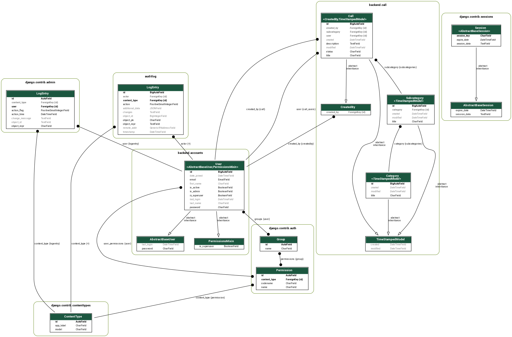

# tcmrj-challenge

Aplicação em Django para abertura de chamados

## Este projeto foi feito com:

* [Python 3.9.4](https://www.python.org/)
* [Django 3.2.4](https://www.djangoproject.com/)
* [Django Ninja 0.13.2](https://django-ninja.rest-framework.com/)
* [Bootstrap 4.0](https://getbootstrap.com/)
* [jQuery 3.4.1](https://jquery.com/)

## Como rodar o projeto?

* Clone esse repositório.
* Crie um virtualenv com Python 3.
* Ative o virtualenv.
* Instale as dependências.
* Rode as migrações.
* Crie um super usuário.
* Crie os dados para teste local.
* Rode os testes.
* Rode a aplicação.

```
git clone https://github.com/rg3915/tcmrj-challenge.git
cd tcmrj-challenge
python -m venv .venv
source .venv/bin/activate
pip install -r requirements.txt
python contrib/env_gen.py
python manage.py migrate
python manage.py createsuperuser
python manage.py create_data
python manage.py test
python manage.py runserver
```

## Docs swagger

http://localhost:8000/api/v1/docs


POST: Adicionar chamado

```
{
  "title": "Título",
  "description": "Descrição",
  "status": "a",
  "user_id": 1,
  "created_by_id": 1,
  "subcategory_id": 1
}
```


## pytest

Rode o comando

```
pytest
```

## Models

```
python manage.py graph_models -a -g -o img/models.png  # or
python manage.py graph_models -e -g -l dot -o img/model.png accounts call
```



